ggthemr
========================================================

Themes for ggplot2. The idea of this package is that you can just set the theme and then forget about it. You shouldn't have to change any of your existing code. There are several parts to a theme:

* Colour palette for the background, axes, gridlines, text etc. 
* Layout of axes lines and gridlines.
* Spacing around plot and between elements (i.e. axes titles to axes lines etc). You can set the spacing to determine how compact or spread out a plot is.
* Text size.

There are a number of preset palettes and layouts, and methods to create your own colour schemes.


Installation
-------------------------

This package is still under development and isn't too stable yet, but can be installed using [devtools](http://cran.r-project.org/web/packages/devtools/index.html).


```r
devtools::install_github('ggthemr', 'cttobin')
```

Usage
-------------------------

To just set the colour scheme:


```r
ggthemr('dust')
```

That's it. Any ggplot you create from then on will have the theme applied. To set colour scheme, layout, spacing etc.:


```r
ggthemr(palette = "dust", layout = "clear", spacing = 1.6,
  text_size = 12, type = "inner", line_weight = 0.5)
```


Further Development
-------------------------

Features on the way:
* More palettes and layouts.
* Ability to create user palettes.
* Methods to tweak existing palettes.
* Options to control fonts.


Palettes
-------------------------

The palette determines the colours of everything in a plot including the background, layers, gridlines, title text, axes lines, axes text and axes titles. The *swatch* is the the name given to the set of colours strictly used in styling the geoms/layer elements (e.g. the points in *geom_point()*, bars in *geom_bar()* etc.). At least six colours have been supplied in each palette's swatch. 

There are a wide variety of themes in this package (and more on the way). Some of them serious business... others are delibrately stylish and might not be that good for use in proper publications. 

### camoflauge
  
   
  
### chalk
  
  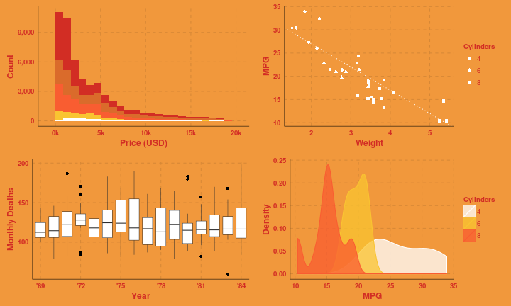 
  
### copper
  
  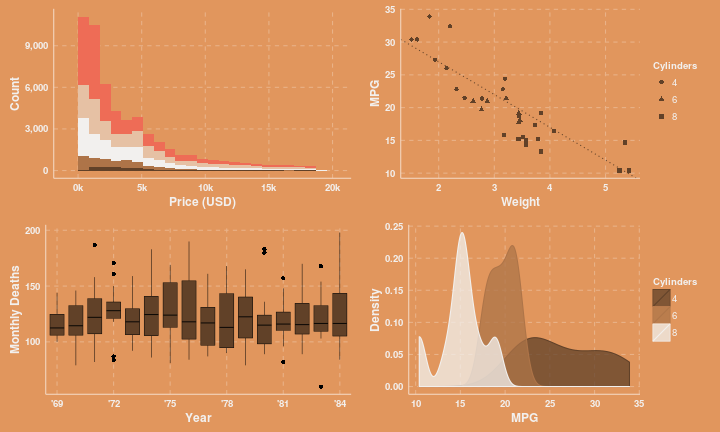 
  
### dust
  
  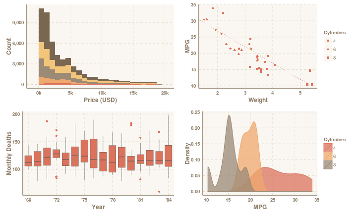 
  
### earth
  
  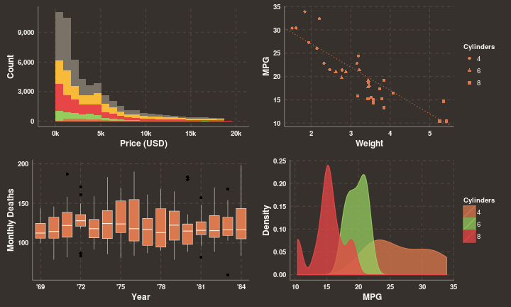 
  
### fresh
  
  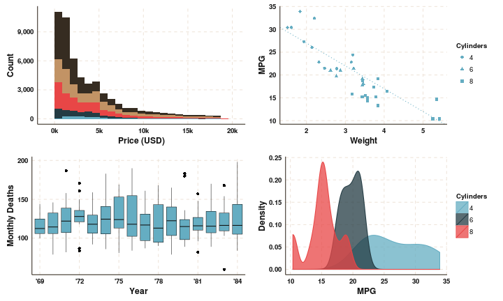 
  
### grape
  
  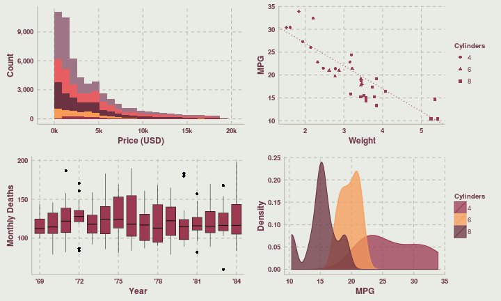 
  
### grass
  
  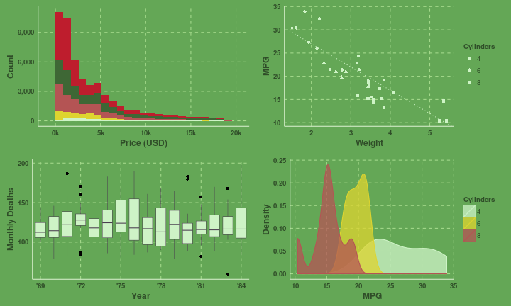 
  
### greyscale
  
  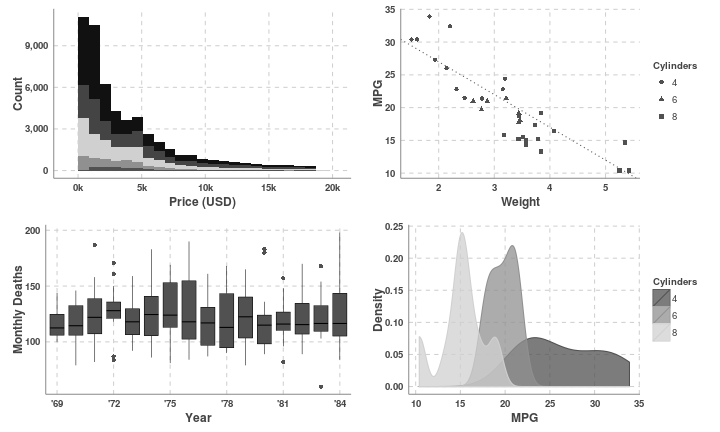 
  
### light
  
  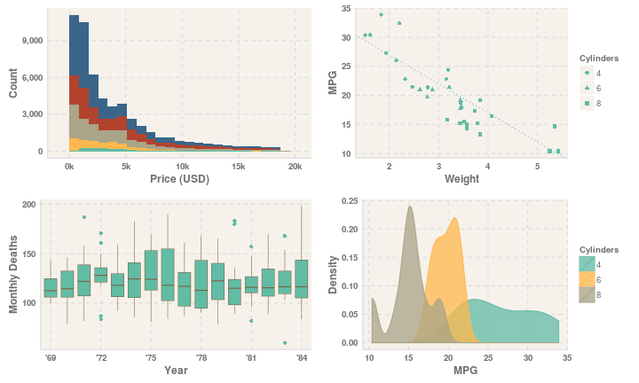 
  
### lilac
  
  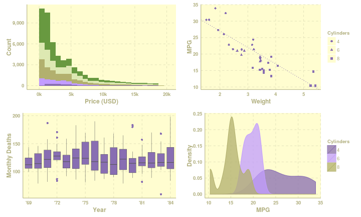 
  
### pale
  
  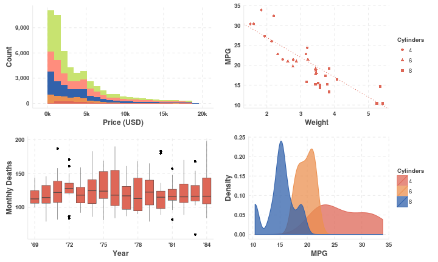 
  
### sea
  
  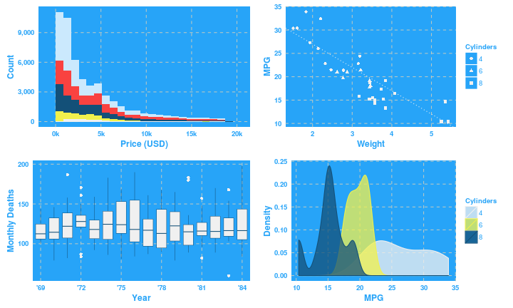 
  
### sky
  
  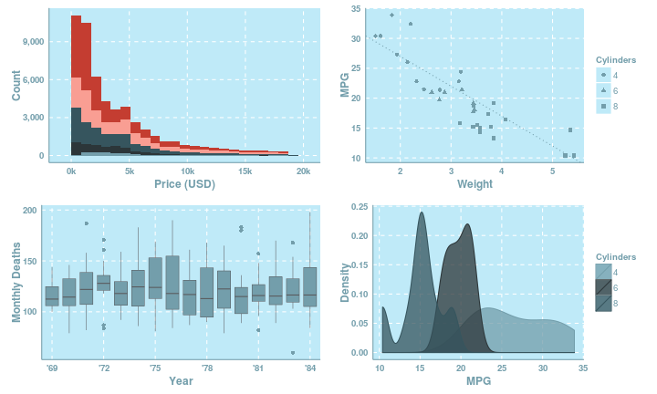 
  
### solarized
  
  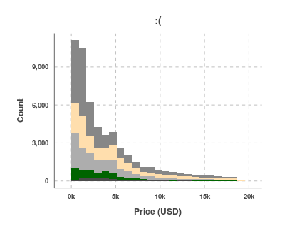 
  

Layouts
-------------------------

The layout of a theme controls the appearance and position of the axes, gridlines and text. Some folk prefer both major and minor gridlines, others prefer none or something in between. 

### Clean
  
  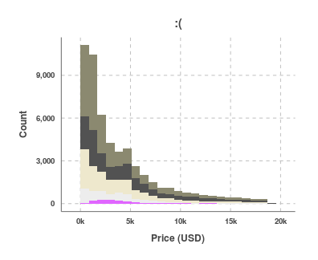 
  
### Clear
  
  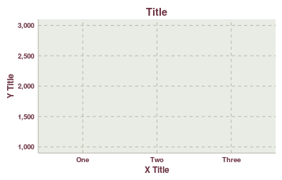 
  
### Minimal
  
  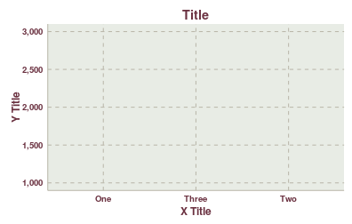 

### Plain
  
  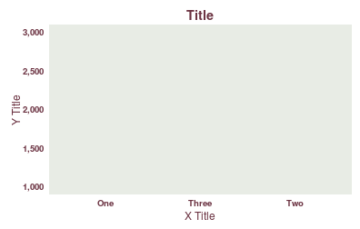 
  
### Scientific
  
  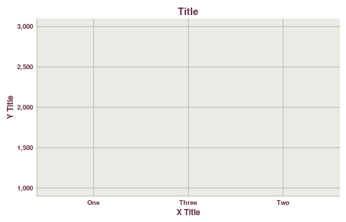 

Spacing
-------------------------

Plot margins and space between axes titles and lines etc. is controlled with the *spacing* parameter. Lower values will make plots more compact, higher values will give them more padding. Compare the plots below where the spacing has been set to 0, 1 and 2 respectively.

 

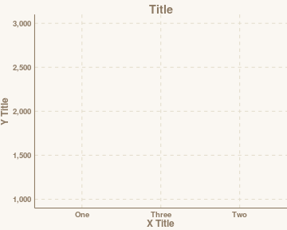 

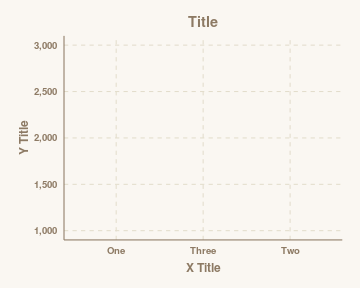 

Type
-------------------------

The *type* parameter can be set to either *inner* or *outer*. When *inner*, the background colour of a plot will not extend past the plot area. *outer* will colour the entire plot and background. 


```r
ggthemr('sea', type = 'inner')
example_plot
```

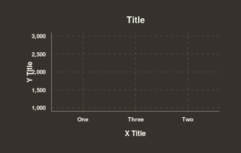 


```r
ggthemr('sea', type = 'outer')
example_plot
```

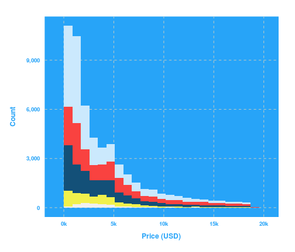 


Adjustments
-------------------------

Most of the time you'll probably just want to set the theme and not worry about it. There may be times though where you'll want to make some small adjustment, or manually change what items appear as what colour in a plot. ggthemr() will return the theme silently, so you can assign it to variable like this:


```r
themr <- ggthemr('dust')
```

Now you can edit the theme stored in *themr*. For example, here's a plot:


```r
mpg_plot <- ggplot(mpg[mpg$drv != '4', ], aes(factor(cyl), cty, fill = drv)) + 
  geom_boxplot() + labs(x = 'Cylinders', y = 'City MPG', fill = 'Drive Type') +
  theme(legend.position = 'bottom')
mpg_plot
```

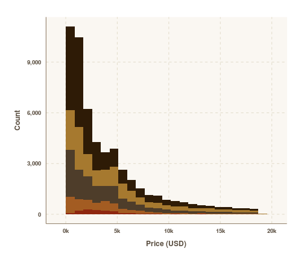 


For some reason you decide you want to change those colours. Front-wheel drive vehicles should be orange. Rear-wheelers should be that red colour. You could change the order of the levels of your fill variable, but you shouldn't have to do that. You just want to switch those colours but you have no idea what they are. *swatch()* will give you the colours in a ggthemr palette. 


```r
swatch(themr)
```

```
## [1] "#555555" "#db735c" "#EFA86E" "#9A8A76" "#F3C57B" "#7A6752" "#2A91A2"
## [8] "#87F28A" "#6EDCEF"
## attr(,"class")
## [1] "ggthemr_swatch"
```

So you can manually swap the two colours around.


```r
to_swap <- swatch(themr)[2:3]
mpg_plot + scale_fill_manual(values = rev(to_swap))
```

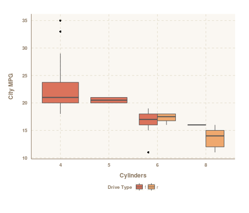 

**Note:** the first colour in a swatch is a special one. It is reserved for outlining boxplots, text etc. So that's why the second and third colours were swapped.
